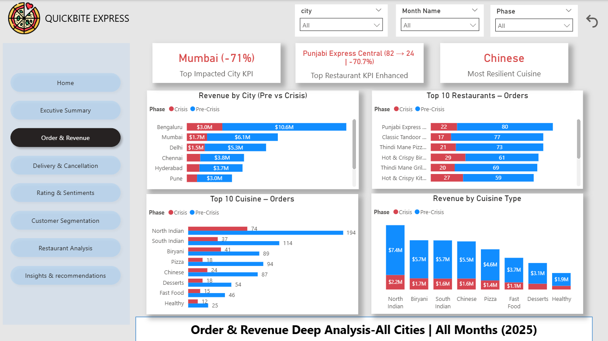

# 🍕 QuickByte Express – Crisis Impact & Recovery Strategy (2025)

## 📌 Executive Summary

This project analyzes the business impact of a crisis period on QuickByte Express, a multi-city food delivery platform operating across major Indian metros.

Using Power BI and DAX-based KPI modeling, I performed a full diagnostic analysis across:

- Revenue performance
- Order volume trends
- Customer retention
- Operational delays
- Cancellation rates
- Customer sentiment
- Restaurant-level risk exposure

The objective was not just to measure the damage — but to design a structured recovery strategy.

---

## 🎯 Business Problem

During the 2025 crisis period, the company experienced a sharp decline in revenue and customer engagement.

Management needed clarity on:

- What caused the revenue collapse?
- Was the issue operational or customer-driven?
- Which cities and restaurants were highest risk?
- How severe was the retention breakdown?
- What actions should be prioritized for recovery?

---

## 📊 Key Impact Metrics (Pre-Crisis vs Crisis)

| KPI | Pre-Crisis | Crisis | Impact |
|------|------------|--------|--------|
| Total Revenue | $75M+ | $48.5M | ▼ -70.9% |
| Total Orders | 114K | 35K | ▼ Major Volume Drop |
| Repeat Customers | 22K | 3K | ▼ -87.6% |
| Avg Delivery Time | 38.7 mins | +5.7 mins | ▲ Delay Increase |
| Rating KPI | 4.5 | 2.5 | ▼ -44.5% |
| Cancellation Rate | 3.3% | 7.45% | ▲ Operational Stress |

---

## 🔎 Core Insights

### 1️⃣ Revenue Collapse Driven by Order Volume
The primary revenue decline was linked to a severe drop in completed orders.

### 2️⃣ Customer Retention Breakdown
Repeat customers fell by 87.6%, indicating loyalty erosion and brand trust damage.

### 3️⃣ Operational Deterioration
Delivery times increased by 5.7 minutes, directly impacting cancellations and ratings.

### 4️⃣ Customer Sentiment Crisis
The most frequent complaint:
> “Food quality is not good” (1,962 reviews)

This signaled product quality failure rather than pricing sensitivity.

### 5️⃣ City-Level Risk Concentration
Mumbai (-71%) and Chennai (-44.9%) showed the highest impact severity.

### 6️⃣ Restaurant-Level Performance Risk
Certain restaurants experienced near-total decline (Urban Wraps Hub -100%).

---

## 🧠 Strategic Recovery Recommendations

✔ Immediate Food Quality Audit  
✔ Supplier & Hygiene Standardization  
✔ Repeat Customer Reactivation Campaign  
✔ Delivery Route Optimization  
✔ Low-Rated Restaurant Intervention Framework  
✔ Reputation Management & Review Response Strategy  
✔ Focused Recovery Rollout in High-Risk Cities  

---

## 📷 Dashboard Preview

### Executive Summary

### Order & Revenue Analysis

### Customer Segmentation

### Insights & Recommendations

---

## 🔗 Live Interactive Dashboard

👉 [View Power BI Report Here](https://tinyurl.com/3aks4cn4)

---
## 🛠 Tools & Skills Demonstrated

**Tools Used**
- Power BI
- DAX (Advanced KPI Calculations)
- Data Modeling
- Business KPI Framework Design

**Analytical Skills**
- Business Impact Analysis
- Customer Retention Analytics
- Operational Performance Diagnosis
- Sentiment Categorization
- Revenue Attribution Analysis
- Executive-Level Storytelling

---

## 📈 Business Value Delivered

This project demonstrates the ability to:

- Translate raw data into business narratives
- Identify root causes behind KPI collapse
- Design actionable recovery strategies
- Communicate insights at executive level
- Combine operational, financial, and customer analytics

---

## 👤 Author

**Sivaratri Teja**  
Aspiring Data Analyst | Business Intelligence Enthusiast  
